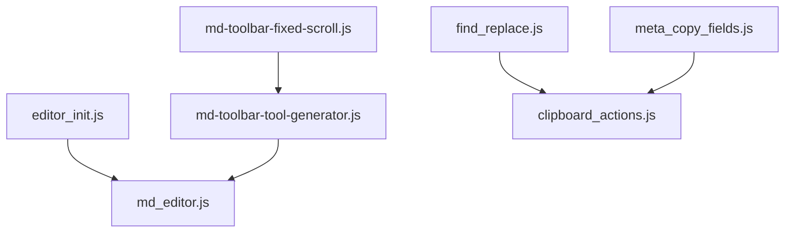

# Specification: JavaScript Modules & Method Chart

This document provides a high-density architectural specification of the client-side JavaScript scripts powering the `md2web-editor` component.

---

## 1. Module Overview & Dependency Tree

The scripts cooperate using shared global scopes on the `window` object to manipulate target DOM nodes within `#notesform`.

---

## 2. Global Script Registry & Method Chart

### `clipboard_actions.js`
* **Purpose**: Safe utility wrapper for writing string text to the user's system clipboard using standard browser APIs.
* **DOM Dependencies**: None.

| Function / Method | Parameters | Return Type | Description |
| :--- | :--- | :---: | :--- |
| `write_to_clipboard` | `(text: string, skip_alert: boolean)` | `void` | Writes string contents to `navigator.clipboard`. Alerts user if copy fails or if `skip_alert` is false. |

---

### `meta_copy_fields.js`
* **Purpose**: Compiles active text area data for clipboard submission.
* **DOM Dependencies**: `textarea#resolution`

| Function / Method | Parameters | Return Type | Description |
| :--- | :--- | :---: | :--- |
| `copy_meta_note_fields` | None | `void` | Pulls the value of `#resolution` and passes it to `write_to_clipboard()`. |
| `copy_starNotes_fields` | None | `void` | Alias binding pointer pointing to `copy_meta_note_fields`. |

---

### `find_replace.js`
* **Purpose**: Search and replace system with regular expression options, matching cases, loose bounds, and clipboard recovery backups.
* **DOM Dependencies**: `textarea#resolution`, dynamically creates `div#find-replace-modal`.

| Method | Parameters | Return Type | Description |
| :--- | :--- | :---: | :--- |
| `init` | None | `void` | Resolves `#resolution` reference and calls UI assembly triggers. |
| `createModal` | None | `void` | Inject HTML for the modal element, options checklist inputs, action buttons, and status label. |
| `attachEvents` | None | `void` | Binds `Enter` key triggers for input searches and `Escape` key close interceptors. |
| `toggle` | None | `void` | Toggles modal open/close states and shifts cursor focus dynamically. |
| `getRegex` | None | `RegExp \| null` | Compiles regular expression flags (`g` vs `gi`) and patterns based on loose-match and case choices. |
| `findNext` | None | `void` | Scans substring forward from selection end. Selects next match range or wraps to document start. |
| `replace` | None | `void` | Backs up text, replaces active selection text with new string, and advances to next match. |
| `replaceAll` | None | `void` | Backs up text, replaces all pattern matches globally in value space. |
| `setStatus` | `(msg: string, isError: boolean)` | `void` | Renders a small response string with colored formatting indicating find outcomes. |
| `backupToClipboard` | None | `void` | Automatically stores pre-replaced text buffer to clipboard in case of replacement errors. |

---

### `md_editor.js`
* **Purpose**: Text insertion, selection range wrapper logic, and auto-list rules on new lines.
* **DOM Dependencies**: `textarea#resolution`

| Method / Binding | Parameters | Return Type | Description |
| :--- | :--- | :---: | :--- |
| `insertTextAtCursor` | `(text: string)` | `void` | Inserts string at target index selection and updates caret offset position. |
| `wrapSelection` | `(prefix: string, suffix: string, defaultText: string)` | `void` | Wraps active selection with start/end formatting characters (e.g. `**` for bold). |
| `toggleLinePrefix` | `(prefix: string)` | `void` | Prefixes or strips prefix strings (like `> ` or `- [ ] `) from selected/active line boundaries. |
| `insertSupportTemplate` | None | `void` | Utility injection shortcut rendering issue/trouble template notes. |
| **`MDF` Map Objects** | None | `object` | Exposes formatting shortcuts: `bold()`, `italic()`, `strikethrough()`, `inlineCode()`, `codeBlock()`, `link()`, `quote()`, `listBullet()`, `listTask()`, `listTaskDone()`, `listOrdered()`, `rule()`. |
| **`keydown` Listener** | `Event` | `void` | Active listener capturing `Enter` (completing prefix listings) and `Tab` / `Shift+Tab` (indenting/dedenting selection blocks). |

---

### `md-toolbar-tool-generator.js`
* **Purpose**: Instantiates visual UI buttons and registers click-handlers pointing to `MDF` controls.
* **DOM Dependencies**: `div#md-toolbar`, `textarea#resolution`

| Function / Method | Parameters | Return Type | Description |
| :--- | :--- | :---: | :--- |
| `generateToolbarButtons` | None | `void` | Wipes `#md-toolbar` child elements and maps arrays of symbols, lists, and markdown tools into button elements. |

---

### `md-toolbar-fixed-scroll.js`
* **Purpose**: Floats/docks the editor toolbar based on client viewport metrics when scrolling.
* **DOM Dependencies**: `div#md-toolbar`, `document.body`

| Event Listener | Triggered On | Behavior |
| :--- | :--- | :--- |
| `scroll` | Window scroll | If browser window width exceeds mobile limits (768px) and toolbar rolls past fold, attaches toolbar to fixed-top position. |
| `resize` | Window resize | Recalculates horizontal coordinates and updates fixed width limits of floating placeholder container. |

---

### `editor_init.js`
* **Purpose**: Bootstrapping/resetting form layout variables on load events.
* **DOM Dependencies**: `form#notesform`, `checkbox#case-notes` (optional), `checkbox#tools` (optional)

| Function / Method | Parameters | Return Type | Description |
| :--- | :--- | :---: | :--- |
| `reset_form` | `(isreset: boolean, isrefresh: boolean)` | `void` | Clicks visibility checkboxes if present, sets `#notesform` input validation, and invokes native form reset functions. |

---
# Copyright (c) 2026:
# vatofichor - Sebastian Mass     [>_<]
# & Assisted By Gemini Antigravity /|\  
