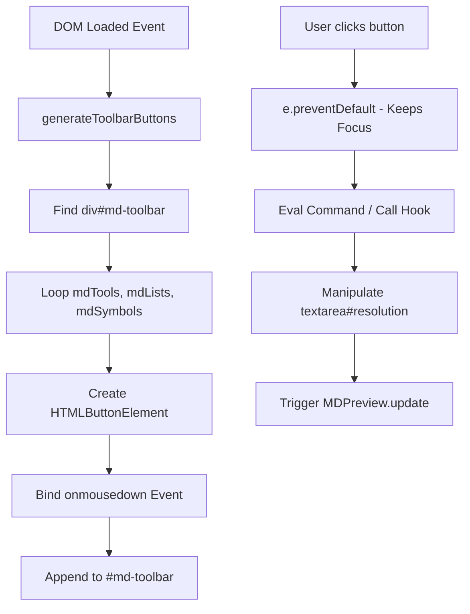

# Specification: Toolbar & Plugin Architecture

This document outlines the design, interaction, and hook specifications for the Markdown Editor Toolbar in `md2web-editor`. It provides guidance for developers wishing to implement custom plugins, extend the formatting methods, or register new toolbar items.

---

## 1. Toolbar Architecture & Flow

The editor toolbar is a dynamic visual component that inserts content markers and wraps text selections inside the core textarea.



### Critical Axiom: Focus Management
Standard button clicks steal focus from inputs. To prevent this and preserve the active selection range:
1. All toolbar buttons bind to the `onmousedown` event instead of `onclick`.
2. The handler invokes `e.preventDefault()`.
3. This keeps the cursor and highlighted text active inside `textarea#resolution` while code edits the text range.

---

## 2. Global Script Hooks & Selection API

Core formatting methods are loaded globally in [md_editor.js](file:///d:/Dev/_PLUGIN-DEV/md2web-editor/editor/js/md_editor.js). Developers can leverage these methods to insert or wrap content.

| Method | Signature | Description |
| :--- | :--- | :--- |
| `insertTextAtCursor` | `insertTextAtCursor(text: string): void` | Inserts raw text at the current cursor index. Moves the cursor to the end of the newly inserted text and retains focus. |
| `wrapSelection` | `wrapSelection(prefix: string, suffix: string, defaultText?: string): void` | Wraps the current highlighted selection with the specified `prefix` and `suffix`. If no text is selected, inserts `defaultText` (defaults to `"text"`) wrapped in the tokens, then selects that placeholder. |
| `toggleLinePrefix` | `toggleLinePrefix(prefix: string): void` | Prepends or strips the specified prefix (e.g., `> ` or `- [ ] `) from the current line. If multiple lines are selected, it applies the logic to all selected lines. Automatically increments ordered lists if `prefix === "1. "`. |

### The `MDF` Interface Mapping
Formatting options are cataloged under the `MDF` namespace object on the global scope:

```javascript
const MDF = {
    bold: () => wrapSelection('**', '**', 'bold'),
    italic: () => wrapSelection('*', '*', 'italic'),
    strikethrough: () => wrapSelection('~~', '~~', 'strikethrough'),
    inlineCode: () => wrapSelection('`', '`', 'code'),
    codeBlock: () => wrapSelection('\n```\n', '\n```\n', ''),
    link: () => wrapSelection('[', '](url)', 'title'),
    quote: () => toggleLinePrefix('> '),
    listBullet: () => toggleLinePrefix('* '),
    listTask: () => toggleLinePrefix('- [ ] '),
    listTaskDone: () => toggleLinePrefix('- [x] '),
    listOrdered: () => toggleLinePrefix('1. '),
    rule: () => insertTextAtCursor('\n---\n')
};
```

---

## 3. Developing Plugins & Custom Toolbar Items

There are two primary integration patterns for registering new toolbar actions or extending markdown parsing capability.

### A. Registering Custom Toolbar Buttons
To add a new button to the toolbar before initialization, push config objects to the global arrays defined in [md-toolbar-tool-generator.js](file:///d:/Dev/_PLUGIN-DEV/md2web-editor/editor/js/md-toolbar-tool-generator.js):
- `mdTools`: Action buttons (left side).
- `mdLists`: List and format prefixes (middle section).
- `mdSymbols`: Symbol shortcuts (right side).

#### Button Object Schema:
```typescript
interface ToolbarButtonConfig {
    label: string;       // Button innerHTML (supports HTML tags like <b> or emojis)
    title?: string;      // Optional hover tooltip
    onmousedown: string; // The JS statement evaluated on mousedown (wrapped in eval)
    id?: string;         // Optional element ID
}
```

> [!NOTE]
> Custom scripts modifying these arrays must execute **before** the `DOMContentLoaded` event fires.

#### Implementation Example:
```html
<!-- Load in index.html after md-toolbar-tool-generator.js -->
<script type="text/javascript">
    // Add custom method to MDF namespace
    window.addEventListener('DOMContentLoaded', () => {
        window.MDF.highlight = function() {
            wrapSelection('==', '==', 'highlighted text');
        };
    }, { once: true });

    // Inject tool definition configuration before generator execution
    // (If scripts are loaded synchronously in order, simple inline scripts work)
    mdTools.push({
        label: "<mark>H</mark>",
        title: "Highlight Text",
        onmousedown: "MDF.highlight()",
        id: "btn-highlight"
    });
</script>
```

---

## 4. Parser/Compiler Pipeline Extension

`md2web-editor` compiles Markdown to HTML client-side using the UMD module defined in [md2web.js](file:///d:/Dev/_PLUGIN-DEV/md2web-editor/editor/js/md2web.js). If you require custom syntax rules (e.g. highlights, custom tags), you can decorate the compilation pipeline without mutating the core files.

### The Parser Decorator Pattern

> [!TIP]
> Always perform compilation extensions by wrapping `md2web.parseMarkdown`. This guarantees compatibility with the live HTML preview box and the standalone compiler preview overlays.

#### Pipeline Extension Hook Example:
```javascript
(function() {
    // 1. Reference original compiler method
    const originalParse = md2web.parseMarkdown;

    // 2. Override with extended wrapper
    md2web.parseMarkdown = function(md, relativePath) {
        if (!md) return '';

        // Pre-processing step: Modify Markdown syntax before parser sees it
        // Example: Convert ++underline++ to HTML underline
        let processedMd = md.replace(/\+\+(.*?)\+\+/g, '<u>$1</u>');

        // Execute original parser pipeline
        let htmlOutput = originalParse(processedMd, relativePath);

        // Post-processing step: Clean up or transform rendered HTML output
        // Example: Convert ==highlight== syntax which was escaped to &lt;mark&gt;
        htmlOutput = htmlOutput.replace(/==(.*?)==/g, '<mark>$1</mark>');

        return htmlOutput;
    };
})();
```

---

## 5. Capturing Custom Hotkeys & Editor Events

Custom shortcuts and key capture listeners should attach to the main editor textarea (`textarea#resolution`) or register on the window.

```javascript
document.addEventListener('DOMContentLoaded', () => {
    const editor = document.getElementById('resolution');
    if (!editor) return;

    editor.addEventListener('keydown', function(event) {
        // Intercepting Ctrl + H to trigger custom highlights
        if (event.ctrlKey && event.key.toLowerCase() === 'h') {
            event.preventDefault();
            if (window.MDF && typeof window.MDF.highlight === 'function') {
                window.MDF.highlight();
            }
        }
    });
});
```

---

# Copyright (c) 2026:
# vatofichor - Sebastian Mass     [>_<]
# & Assisted By Gemini Antigravity /|\  
